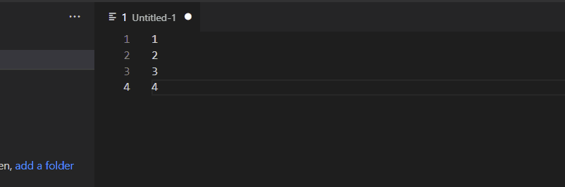
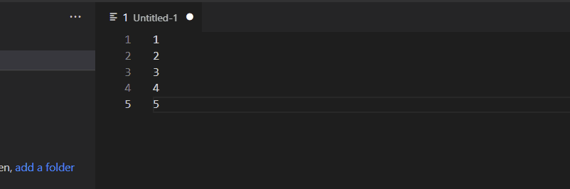

# SQL IN() Formatter

> Based on [sql-in-statements](https://github.com/edwardpcharles/sql-in-statements) by Edward Charles (MIT licensed). This fork adds configurable trimming/dedup/empty-line handling, a "Double Single Quotes" style for `OPENQUERY`, and the `SQL VALUES() Statement` command.

A VS Code extension with two commands for turning a pasted list of values into ready-to-use TSQL:

- **SQL IN() Statement** — one value per line → a SQL `IN()` clause
- **SQL VALUES() Statement** — one row per line (optionally multi-column) → a TSQL `VALUES()` statement

## SQL IN() Statement
1. Create a new editor window
2. Paste a list separated by new lines
3. Highlight the items in the list you want in the `IN()` statement
4. `Ctrl+Shift+P` to bring up the VS Code Command Palette
5. Type: `SQL IN() Statement`
6. Choose a quote style:
   - `With Quotes` — `('abc','def')`
   - `Without Quotes` — `(1,2)`
   - `Double Single Quotes` — `(''abc'',''def'')`, for use inside an `OPENQUERY` string literal

### Creating an IN() Statement with Quotes


### Creating an IN() Statement without Quotes


## SQL VALUES() Statement

Turns a selection into a TSQL `VALUES()` statement, one tuple per line. Each line can hold a single value, or multiple columns split by a delimiter (`sqlIn.valuesDelimiter`, tab by default — matching what you get pasting from Excel).

Select your list, `Ctrl+Shift+P` → `SQL VALUES() Statement`, then pick a quote style (same three choices as above).

Single column:
```
A
B
C
```
becomes
```
values(
('A'),
('B'),
('C')
)
```

Multiple columns (tab-separated by default):
```
A	1
B	2
C	3
```
becomes
```
values(
('A','1'),
('B','2'),
('C','3')
)
```

## Settings

Configure these under `SQL IN() Formatter` in VS Code Settings (`sqlIn.*`):

| Setting | Default | Description |
| --- | --- | --- |
| `sqlIn.trimValues` | `true` | Trim leading/trailing whitespace from each value (or column) before quoting. |
| `sqlIn.skipEmptyLines` | `true` | Skip lines that are empty or contain only whitespace. |
| `sqlIn.removeDuplicates` | `false` | Remove duplicate values (or duplicate rows for VALUES), keeping the first occurrence. |
| `sqlIn.valuesDelimiter` | `\t` (tab) | Delimiter used to split each line into columns for `SQL VALUES() Statement`. Accepts `\t`, `\n`, `\r`, or any custom string such as `,` or `\|`. |

**Enjoy!**

---

This project started as a fork of [sql-in-statements](https://github.com/edwardpcharles/sql-in-statements) by Edward Charles (MIT licensed) — thank you for the original idea and implementation.
